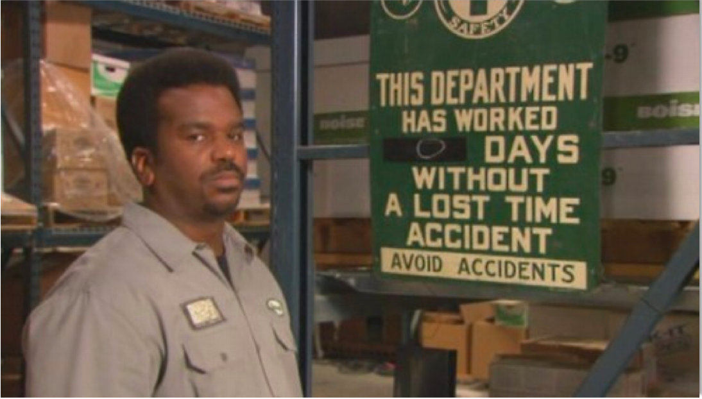
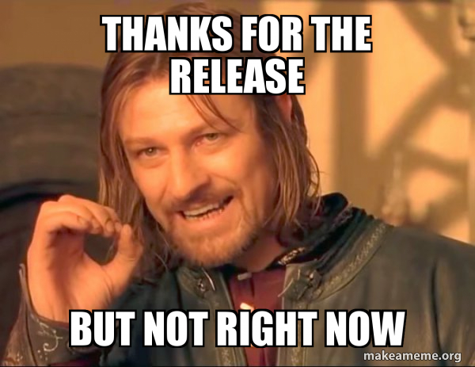

% devops
% 
% April 26, 2019

# Plan
#
::: nonincremental
- Hallvard provides us with latest news before 9:00
- Introduction. History of devops 9:00
- CI Tools 10:00
- CircleCI part1 10:00
- Workshop 10:45
- Dinner 12:00
- CircleCI part2 12:30
- Workshop 13:00
- DevSecOps 14:30
- Workshop 14:45
- Conclusion 15:30
:::

# Why are we here today?
::: incremental
- See each other
- Listen
- Talk
- Do exercises
- Take something into your projects
- Check notifications on your phone
:::

#
> Failure sucks but instructs. Bob Sutton

# What is devops? 
::: incremental
- shared, clearly defined goals
- ongoing communication
- dynamic adjustment and repairs of understanding
:::

#
{ width=50% heigth=50% }

# Shared understanding
::: incremental
- Implementing a new feature that increases the value to customers
- Maintaining safety and trust in communication with each other
:::

# History of devops
# Developer as operator at World War II
#
- Jean Bartik and other 5 women learned to program ENIAC
with no documentation and no plans

#
- Programming ENIAC and its 18,000 vacuum tubes meant setting dials
and changing out cable connections across 40 control panels.

#
- The hardware engineers would come and proclaim

> "It's not the machine; it's the operators."

# Advent of software engineering for moon landing
#
Margaret Hamilton while working at NASA is credited with coining
the term *sofware engineering*

# Software engineering concerns
#
::: incremental
- debugging all individual components
- testing individual components prior assembly
- integration testing
:::

# NATO Software Engineering conference 1968
# 
Key problems with software engineering:

::: incremental
- defining and measuring success
- building complex systems requiring large investments and unknown feasibility
- producing systems on schedule and to spec
- putting economic pressures on manufacturers to build specific products
:::

# Advent of proprietary software and standardization
#
::: incremental
- Until 1964 it was common to build computers to customer requirements
- Software and hardware were not standardized or interchangeable
- In 1964 IBM announces mainframe System/360
- In 1969 IBM again impacted the industry by decoupling software and hardware
- This changed how software was viewed
- It suddenly acquired significant monetary value of itself and was not provided openly
:::
# Age of network
#
::: incremental
- Usenet was started in 1979
- facilitated sharing of knowledge
- talking about solving problems outside of companies was not done in fear of losing competitive advantage
- cultural siloization grew in complexity
- Institutional Tower of Babel
- high level programming languages meant programmers moved farther away from hardware
:::

# Beginnings of global community via interconnected networks
#
::: incremental
- user groups
- One of the first: DECUS Digital Equipment Computer User's Society
- Contrary to focus on knowledge sharing, there was a great deal of secrecy regarding their practices
:::

# Age of applications and the Web
#
::: incremental
- 1995 Apache HTTP server is released
- marks the beginning of a trend toward open source solutions
- Linux, Apache, MySQL, PHP
- The Bastard Operator From Hell
- ops say no since "it's critical to preserve stability"
- devs say "it's critical to get these changes out"
:::

# Growth of Software Development Methodologies
#
::: incremental
- 2001 Extreme programming
- Agile development
- 2004 Agile Manifesto
:::

# Open Source Software, Proprietary Services 
#
::: incremental
- web software commodization
- 2006 Amazon launches EC2 & S3
- virtualized compute & storage resources via proprietary service
- ease of use
- low entry cost
- flexibility
- 2006 Twitter
:::

# Agile Infrastructure at Agile 2008 conference
#
::: incremental
- 'Agile operaitons and Infrastucture' Patrick Debois
- 'Agile Infrastructure' Andrew Clay Shafer, but did not attend himself
- Patrick contacted him
- 2009 O'Reilly Velocity conference, Allspaw & Hammond '10+ deploys per day'
:::

# Beginning of devopsdays
October 2009 Patrick Debois after he did not manage to visit Velocity conference organises first devopsdays conference

> I was kinda giving up, maybe the idea was too crazy:
> developers and ops working together

# Current state of devops
#
Companies doing devops are outperforming those who aren't

#
showing numerically that an emphasis on having individuals work together effectively is better for business than silos full of engineers who do not play well with others.

# devops organizations
- deploy more frequently
- have fewer failures
- recover faster
- have happier employees

# Historical links
 
## Allspaw, Hammond, "10+ Deploys Per Day at Fickr"
 

## The (Short) History of DevOps
 

## dev2ops.org 
<http://dev2ops.org/2007/08/>

# From
"Please go faster"

{ width=50% heigth=50% }

# To
"Please slow down"

{ width=50% heigth=50% }

# Done == Deployed

# Thank you
